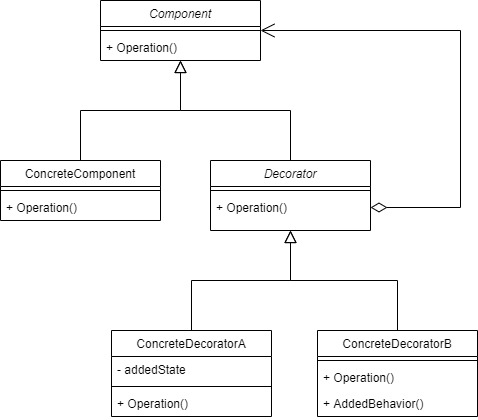
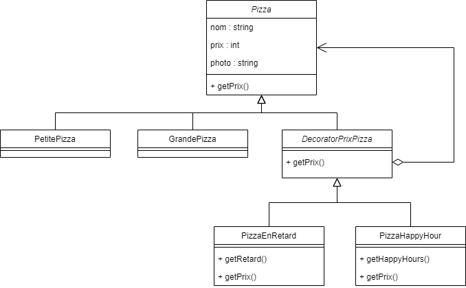
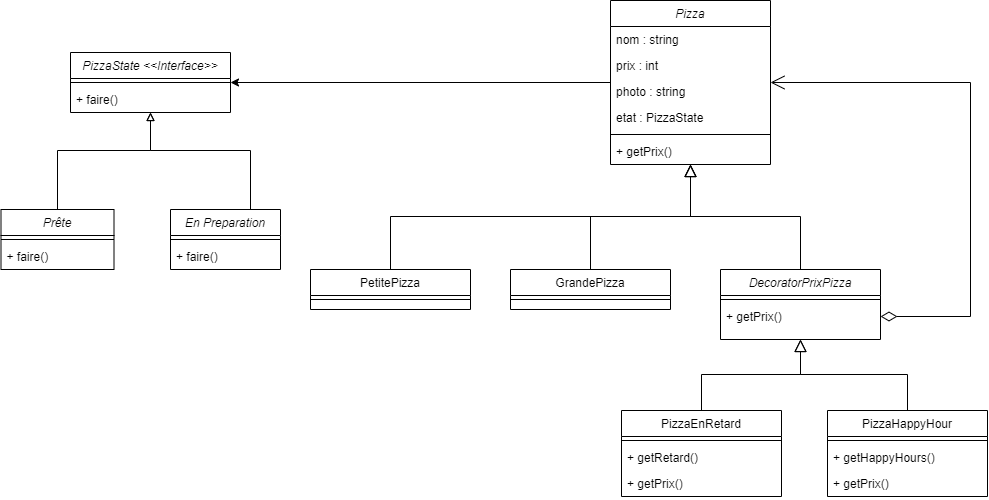

## Pattern Decorator et State

### Question 1

Voici les erreurs que nous avons détectées :

- Personne : l'attribut numéro de téléphone devrait être dans Collaborateur car un client n'a pas a renseigné son numéro
- Personne : l'adresse n'a pas à être précisé pour un collaborateur
- Commande : il n'y a pas le prix de la commande 
- Système : Il n'y a pas assez de méthodes, nottament pour affecter un collaborateur à un point pizza ou à une livraison. 

### Question 2

Le patron de conception **Decorator** permet d'ajouter dynamiquement des responsabilités à un objet existant. Cette solution ressemble à l'héritage que nous connaissons déjà, mais elle propose en réalité plus de souplesse que celui-ci.

Ici, nous avons plusieurs éléments :

- **Component** : il représente à la fois les objets décorés et les décorateurs
- **ConcreteComponent** : représente un objet décoré ou à décorer
- **Decorator** : l'interface des décorateurs
- **ConcreteDecorator** : les décorateurs

Les décorateurs permettent d'ajouter des fonctionnalités à des objets existants. Par exemple, on peut utiliser ce patron dans la modération de mails en ajoutant une modération (`ModeratorInsulte`) sur les insultes et une autre sur la diffusion d'emails (`ModeratorEmail`). 

Sans la patron de conception Decorator, on aurait un héritage de la forme : `ModeratorEmail` qui hérite de `ModeratorInsulte` qui lui-même hérite de `Moderator`. Cette conception pose des problèmes de compréhension : pourquoi `ModeratorEmail` hériterait-il de `ModeratorInsulte` ? Et surtout, elle poserait des problèmes quand à l'indépendance des fonctionnalités : l'ajout de la fonctionnalité `ModeratorEmail` obligerait à utiliser `ModeratorInsulte`.

Ainsi, le patron Decorator permet l'ajout dynamique de fonctionnalités indépendantes.

Dans notre cas on obtient ce diagram :

L'avantage d'un tel système est d'ajouter des options sans tout redfinir ou faire un héritage en chaine. Dans nos cas, on pourra donc facilement avoir une grande pizza, avec une réduction lié au retard ainsi qu'une réduction lié aux happy hours

### Question 3

Nous avons apporter des modifications afin d'avoir une gestion des état de la pizza sans utiliser la conditionelle java

Sources : [design pattern decorator](https://blog.elao.com/fr/dev/design-pattern-decorator/)
